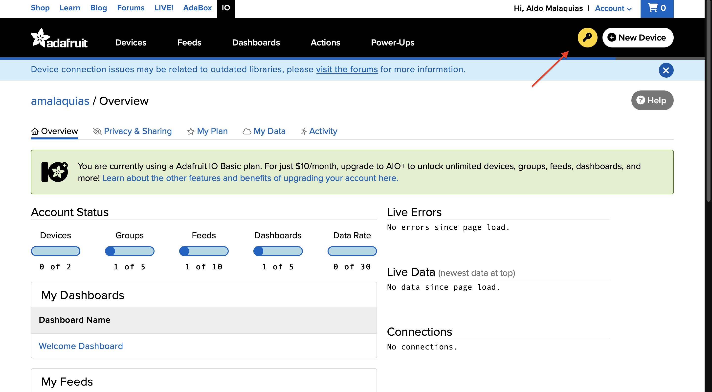
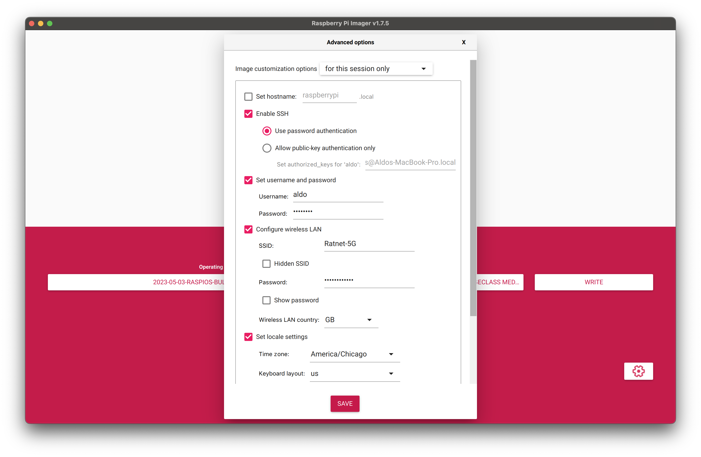
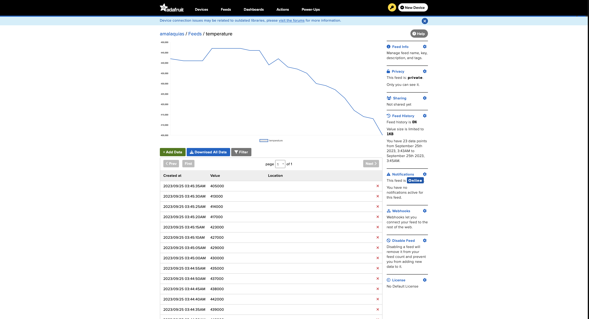
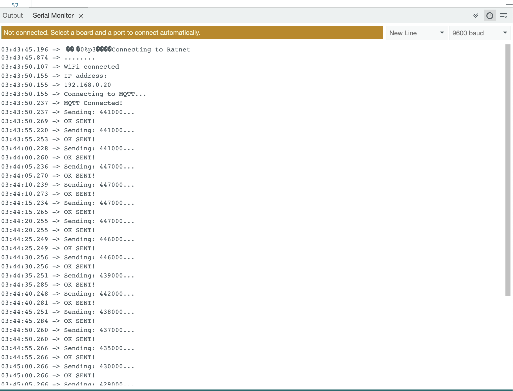
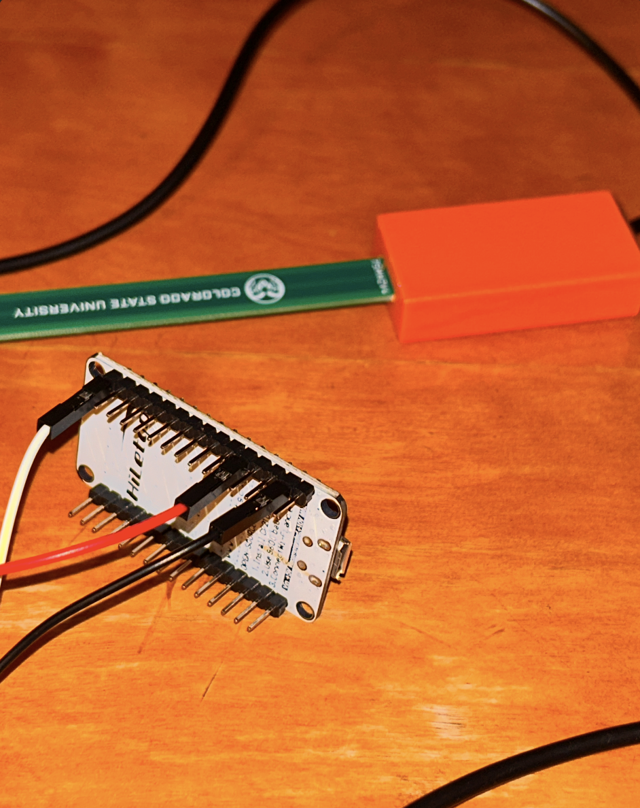

# ESP8622 and SoilSensor

Instructions for sending soil probe readings over WiFi to Adafruit and a Raspberry Pi using MQTT

---
## Setting Up: 

#### Adafruit
1. Go to [Adafruit IO](io.adafruit.com) and create an account
2. Click the IO Key Link to generate your username and key 
3. Store the username and key

#### Arduino
1. Install [Arduino IDE](https://www.arduino.cc/en/software)
2. Go to **Preferences** 
3. At the bottom, copy and paste this link: `http://arduino.esp8266.com/stable/package_esp8266com_index.json` into "Additional boards and managers URLs" and click "OK"
4. Access **Tools > Board > Boards Manager** and install "esp8266 *by ESP8266 Community*"
5. Restart Arduino IDE
6. Under **Tools > Board > esp8266**, select "Generic ESP8266 Module"
7. Under **Tools > Flash Size**, select "4MB (FS: 3MB OTA: ~512KB)"
8. Go to **Library Manager** and install "Adafruit MQTT Library *by Adafruit*"
> Note: if prompted, install without dependencies
9.  Verify that `adafruit.ino` compiles successfully

#### Raspberry Pi
1. Install the [Raspberry Pi Imager](https://www.raspberrypi.com/software/)
2. Download the [Raspberry Pi OS (64-bit) with desktop](https://www.raspberrypi.com/software/operating-systems/#raspberry-pi-os-64-bit)
3. Open the Pi Imager and connect a micro-SD to your computer
4. Select the downloaded OS image and storage option
5. Select the gear icon to change these settings:
   1. Enable SSH with password authentication
   2. Set username and password
   3. Configure Wireless LAN
   4. Set timezone
   
6. Write the OS to the micro-SD card
7. Remove the micro-SD card and insert it on the underside of the RPi
8. Connect the RPi to a monitor, keyboard, and mouse
9.  Turn on the RPi by connecting the power supply and wait around five minutes

---

## Sending Values
#### Adafruit:
1. Open `adafruit.ino` and follow the instructions at the top
2. You should see data being sent from the ESP8266 to Adafruit
   
   
3. For now, the sensor is connected to the ESP8266 like this:
   1. Black wire to "GND"
   2. Red wire to "3v3"
   3. White (moisture) or blue (temperature) cable to "A0"
   

---

## To-Do
1. Obtain variable resistors to make a circuit that will allow reading both temperature and moisture values with just one ADC pin on the ESP8266
2. Implement ping function to keep MQTT connection alive when not sending data for long periods of time
3. Add subscription example for message receiving
4. Obtain micro-HDMI cable to set up RPi
   1. SSH access is denied even when the RPi is flashed with WLAN and SSH configurations
5. Set up Mosquito on the RPi
6. Make the RPi a SAGE node
   1. No documentation available for this
7. Create Python code to pull data from MQTT server and send it to the Beehive
